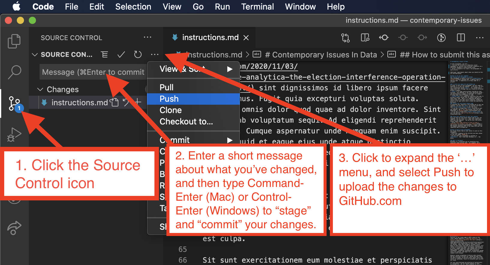

# Interfaces Exercise

A riddle wrapped around an enigma containing interfaces in Java.

## Instructions

Your assignment requires you to create two classes that provide different implementations of the same interface, which is given to you. Several additional class definitions will also be needed to solve the assignment.

### The big idea

Sentences contain words. Words contain characters The order of these words and characters is important for many human languages.

If you were trying to model human written language, you might decide to create a **Sentence** class to represent sentences, a **Word** class to represent words, and a **Character** class to represent characters.

- Since sentences contain words, any `Sentence` object would have to encapsulate a list of `Word` objects.
- Since words contain `Character` objects, any `Word` object would have to encapsulate a list of `Character` objects.
- Since both `Sentence` and `Word` objects contain sequentially ordered lists of things, you might make them both implement the same `SequentiallyOrdered` interface to guarantee consistency of behavior.
- Since both `Word` and `Character` objects can be stored in ordered lists, you may have them both inherit from a common `OrderedThing` class that may contain any attributes shared by all ordered things.

### The SequentiallyOrdered Interface

The following interface code is given to you. The `Sentence` and `Word` classes that you will create must implement this interface.

```java
package edu.nyu.cs;

import java.util.ArrayList;

public interface SequentiallyOrdered {

    public abstract OrderedThing getFirst();
    public abstract OrderedThing getLast();
    public abstract ArrayList<OrderedThing> getSequence();

}
```

### The Character Class

You will need to create a class that represents a single character of text.

- `Character` extends `OrderedThing` because each `Character` object will be stored in an ordered `ArrayList` of `Character` objects in a Word object.

Note: _a class named `Character` already exists in the Java API `java.lang` package, so your class with the same name hides that one. If you want to refer to that API class (which you shouldn't need to), you'll need to reference it by its full package and class name, such as `java.lang.Character` in your code._

### The Word Class

You should create a class `Word` that represents words in a language.

- `Word` implements the `SequentiallyOrdered` interface, because a word is a sequence of characters.
- `Word` extends `OrderedThing` because each `Word` object will be stored in an ordered `ArrayList` of `Word` objects in a `Sentence` object.

#### Instance attributes

The `Word` class should have two instance fields:

- an instance field of type `ArrayList<Character>` which will store a word's character sequence as `Character` objects.
- an instance field of type `int`, representing the `Word`'s position in a `Sentence` in which it is being used (with the first `Word` in a `Sentence` being position 0).

#### Instance methods

Word should have the following methods:

- `getFirst()` should return the first `Character` object of the Word
- `getLast()` should return the last `Character` object of the Word
- `getSequence()` should return an `ArrayList` containing all the `Character` objects in the Word.
- `getPosition()` should return the `int` representing the `Word`'s position in the sentence

#### Hint

Based on the description of this class above, it should be clear to you how `Word` implements the `SequentiallyOrdered` interface, which requires the `getFirst()` and `getLast()` methods to return an `OrderedThing`. If not, here is a hint: a child class can be considered an instance of its parent class... this is polymorphism. So a `Character` object, since it extends `OrderedThing`, can also be considered an instance of the `OrderedThing` class.

#### Constructors

The `Word` constructor should take two parameters:

- a `String` parameter and add the individual characters of the `String` to the `ArrayList<Character>` instance field.
- an `int` parameter representing the position of the `Word` in a `Sentence` and set the relevant instance field accordingly

### The Sentence Class

You should create a third class, `Sentence`, that represents sentences in a language. `Sentence` implements the `SequentiallyOrdered` interface, because a sentence is a sequence of words.

#### Instance attributes

Sentence should have a single instance field of type `ArrayList<Word>` which will store the words of a sentence. This relationship between the `Sentence` and `Word` classes is called composition, because a `Sentence` is composed of `Word`objects.

Note: _there is NOT an inheritance relationship between `Sentence` and `Word`_.

#### Instance methods

Sentence should have the following methods:

- `getFirst()` should return the first `Word` of the `Sentence`,
- `getLast()` should return the last `Word` of the `Sentence`
- `getSequence()` should return an `ArrayList` containing all the `Word` objects in the `Sentence`.

#### Hint

Based on the description of this class above, it should be clear to you how `Sentence` implements the `SequentiallyOrdered` interface, which requires the `getFirst()` and `getLast()` methods to return an `OrderedThing`. If not, here is a hint: a child class can be considered an instance of its parent class... this is polymorphism. So a `Word` object, if it extends `OrderedThing`, can also be considered an instance of the `OrderedThing` class.

#### Constructors

The `Sentence` constructor should take a single `String` parameter representing the `Sentence`, and add each `Word` of the sentence to the `ArrayList<Word>`. You can split the `String` into words by using the `String` `split()` method in the following way:

```java
// split by any non-alphanumeric character
String[] words = s.split("[^\\w']+")
```

Notice that the `split()` method will give you an array of `String` objects, and you will need to go through that array, creating `Word` objects and adding them to the `ArrayList<Word>`.

### The TestSequence Class

Create a test class with a `main` method that shows how a `Sentence` object can be instantiated with a sentence of your choosing, how each of the methods of the `Sentence` class can be called in a meaningful way, and how each of the methods of the `Word` class can be called on at least one of the `Word` objects encapsulated within the `Sentence` object's `ArrayList<Word>` instance field that you created.

### Folder structure

This project has several important directories:

- `src` - contains the Java source code for the project (i.e. `.java` files)
- `bin` - contains the compiled code (i.e. `.class` files)
- `lib` - contains any dependencies (other libraries of code that the project depends upon to work)

If your project has no dependencies and has not been compiled, you may not see the `lib` or `bin` directories.

## How to submit this assignment

Once you have completed the changes to th assignment, you are ready to submit it. Do this from within Visual Studio Code.

1. Click on the `Source Control` icon in the left activity bar in Visual Studio Code.
1. In the Source Control side bar, you will see a field named `Message` - type in a unique message about what you have done, e.g. "_Finished assignment!_" or whatever you want to write as a short note to yourself.
1. Hover over the words `Source Control`. You will see a `...` icon appear - click it to see a menu. In that menu, click `Commit`->`Commit`. This logs the changes you've made to the Git project - remember Git is used to keep track of changes.
1. Go to the same menu and click `Push` to submit your assignment - this uploads your updated files to the copy of your respository on GitHub.



That's it... you're done.

## Double-check your submission

Prove to yourself that you have correctly submitted by viewing your repository on the GitHub website - you should see your completed README.md file there.

## Resubmit as many times as you want

You can re-submit as many times as you want before the deadline. Just make changes to the files on your own computer and repeat the process outlined above to upload them to GitHub.
